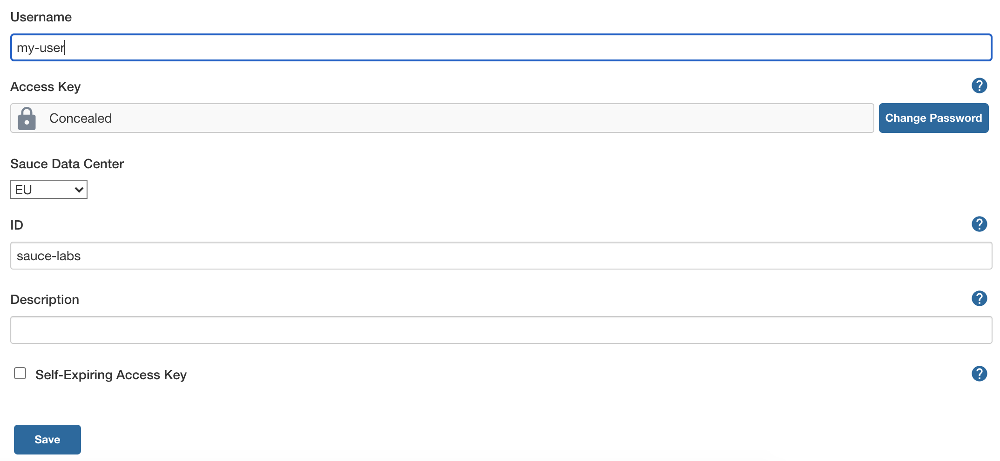
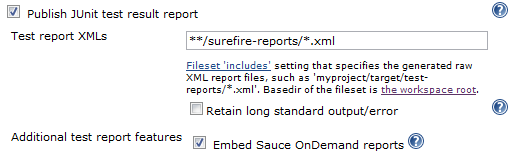

# Sauce OnDemand

This plugin allows you to integrate [Sauce Selenium Testing](https://saucelabs.com/platform/automation-tools/selenium) with Jenkins.
Specifically, you can:

-   Automate the setup and tear down of [Sauce Connect](https://docs.saucelabs.com/secure-connections/sauce-connect/)
-   Integrate the Sauce Labs result videos per test

## Configuration

After installing a plugin, specify your Sauce Labs access credentials in
the Manage Credentials page as follows:



Once this is set, on each job configuration page, you can tell Jenkins to
launch a [Sauce Connect Proxy](https://docs.saucelabs.com/secure-connections/sauce-connect/)
instance for the duration of the build. For more details about the concept
of secure connection in the context of Sauce Labs, see [the documentation](https://docs.saucelabs.com/secure-connections/sauce-connect/).

### Embedded Test Reports

You can show an embedded Sauce Labs test report on the test result
pages in Jenkins. To enable this, check 'Embed Sauce OnDemand reports' as part
of the 'Publish JUnit test result report section'.



In addition, you will need to output the following line to your for each
test that is run using Sauce Labs:

```shell
SauceOnDemandSessionID=YOUR_SESSION_ID job-name=YOUR_JOB_NAME
```

where `YOUR_SESSION_ID` is the SeleniumRC/WebDriver session id and
`YOUR_JOB_NAME` is the name of the test being executed.

### Issue Tracking

Please raise any issues you find with the plugin or requests for
additional features within the plugin's
[Jira](https://issues.jenkins.io/browse/JENKINS/component/15751)
instance.

### Contributing
Refer to our [contribution guidelines](./CONTRIBUTING.md).

### Changelog

See <https://github.com/saucelabs/jenkins-sauce-ondemand-plugin/blob/master/CHANGELOG.md>
